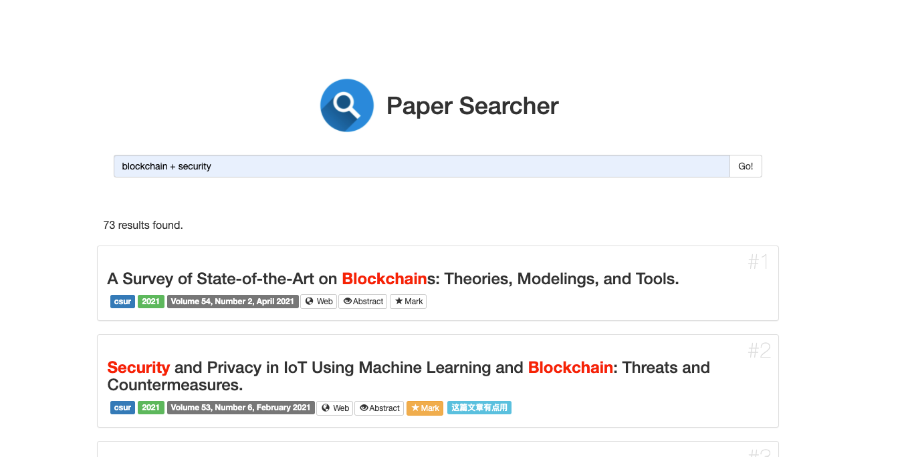

# paperSearcher
一个搜索网络安全领域顶会论文的小工具

使用python3编写，数据库内容将不定期更新，目前收录了2016~2020，以及部分2021的文章，包含：

- Computer and Communications Security (CCS)
- IEEE Symposium on Security and Privacy (S&P)
  - International Security Protocols Workshop (SPW)（这个不是CCF A，是SP的Workshop）
- USENIX Security Symposium (USS)
  - CSET @ USENIX Security Symposium (CEST)（非CCF A, USENIX Workshop）
  - FOCI @ USENIX Security Symposium (FOCI)（非CCF A, USENIX Workshop）
  - SOUPS @ USENIX Security Symposium (SOUPS)（CCF C？, USENIX Workshop）
  - WOOT @ USENIX Security Symposium (WOOT)（非CCF A, USENIX Workshop）
- IEEE Transactions on Dependable and Secure Computing (TDSC)
- IEEE Transactions on Information Forensics and Security (TIFS)
- Network and Distributed System Security Symposium (NDSS) （CCF B，但是质量比较高，也收录了）
- Annual Computer Security Applications Conference (ACSAC)（CCF B，但是质量比较高，也收录了）
- ACM Computing Surveys (CSUR)（CCF None，但是质量比较高，也收录了）


使用Flask作为基础框架，写的比较简单，主要为实现功能，代码很丑（一下午撸完前后端，凑合看）

有些功能应该放后端做比较好，当时写的时候脑子有点抽，后面有时间再慢慢改吧

## 安装方法

安装完Python3之后，将本仓库clone到本地，使用pip安装flask即可。

```bash
git clone https://github.com/mactavishmeng/paperSearcher.git
cd paperSearcher
pip3 install -r requirements.txt
python3 website.py
```

## 使用方法

默认开放在`http://127.0.0.1:5000`，可以修改webpage.py中的最后一行，来指定监听的IP和端口：

```python
if __name__ == '__main__':
    app.run(host='0.0.0.0', port=80, debug=True)
```

建议仅在本地使用，不要开在0.0.0.0（因为查询接口可能有SQL注入，写的匆忙……没有做太多防护）

查询逻辑非常简单，通过 `+` 与 `|` 分割关键字。

比如：

- 关键字为`blockchain+security`，查询结果则在 title 和 abstract 中搜索同时包含`blockchain`和`security`的文章。
- 关键字为`security | internet of things | evaluation`，表示只要任意出现 `security`, `internet of things`, `evaluation`这三个关键词的任意一个，就会返回该条记录。

## 更新记录

2021.06.25

- 更新数据库：新增 ACM Computing Surveys Volume 54, Number 3, June 2021（共23篇）；
- 更新数据库：新增"BIB"列，用于存储`.bib`格式的引用文件；
- 更新UI界面，新增"Cite"按钮，用于下载`.bib`格式的引用文件；
- 更新UI界面，新增来源缩写的全名显示，将鼠标悬停在缩写标签上即可。

2021.09.06

- 更新数据库：新增 IEEE Communications Surveys and Tutorials, 2016 ~ 2021（共636篇）
- 更新数据库：新增 USENIX Security Symposium'21（共247篇）
- 更新UI界面：新增会议标签`comsur`（IEEE Communications Surveys and Tutorials）

2021.10.26
- 更新数据库：新增 IEEE Symposium on Security and Privacy, 2021（共115篇）
- 更新数据库：新增 IEEE Transactions on Dependable and Secure Computing, 2021, July ~ October（共70篇）
- 更新数据库：新增 ACM Computing Surveys, 2021, July ~ September（共87篇）
- 更新数据库：新增 IEEE Transactions on Information Forensics and Security, 2021（共92篇）

2021.12.13
- 更新数据库：新增 Annual Computer Security Applications Conference, 2021（共81篇）
- 更新数据库：新增 Computer and Communications Security, 2021（共226篇）
- 更新数据库：新增 CSET @ USENIX Security Symposium, 2021（共13篇）
- 更新数据库：新增 IEEE Transactions on Dependable and Secure Computing, 2021, November（共33篇）
- 更新数据库：新增 ACM Computing Surveys, 2021, November ~ December（共43篇）
- 更新数据库：新增 IEEE Communications Surveys and Tutorials, 2021, Fourthquarter（共24篇）
- 更新数据库：新增 IEEE Transactions on Information Forensics and Security, 2021（共46篇）

2022.02.28
- 更新数据库：新增 IEEE Transactions on Dependable and Secure Computing, 2022, January~February（共49篇）
- 更新数据库：新增 IEEE Transactions on Information Forensics and Security, Volume 17, 2022（共46篇）
